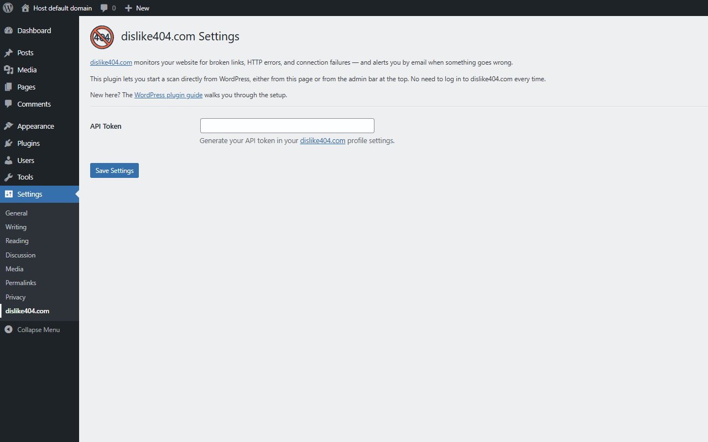
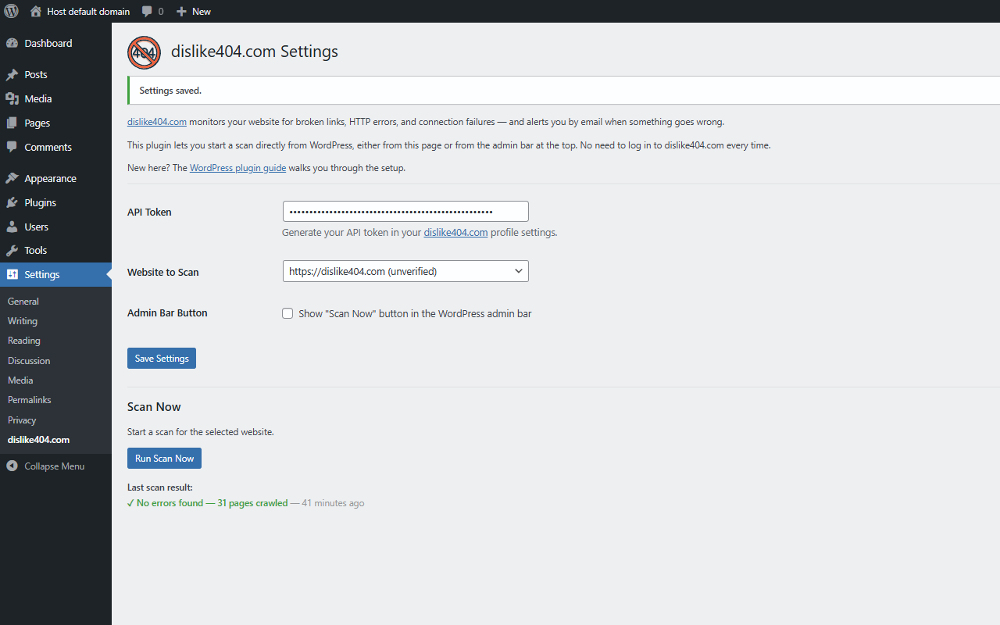
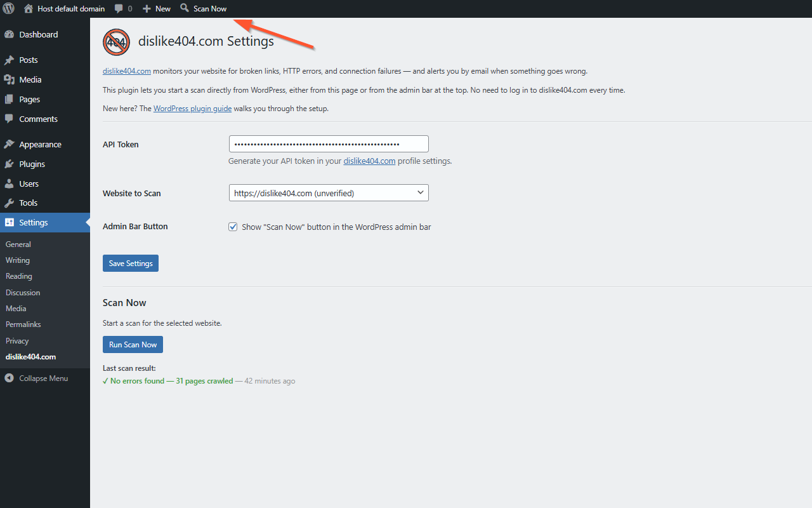

# dislike404.com Broken Link Checker — WordPress Plugin

Connect your WordPress site to [dislike404.com](https://dislike404.com) and trigger website scans directly from your WordPress admin panel.

dislike404.com monitors your website for broken links, HTTP errors, and connection failures — and alerts you by email when something goes wrong.

---

## Features

- Start a website scan with a single click from the WordPress admin panel
- Optional **Scan Now** button in the admin bar for quick access on every page
- Real-time scan status — see when the scan is running, finished, or if errors were found
- Direct link to the full scan report on dislike404.com
- Connects securely to dislike404.com via an API token

## Requirements

- A free account at [dislike404.com](https://dislike404.com)
- At least one website added to your dislike404.com account
- An API token generated in your dislike404.com profile
- WordPress 6.0 or higher
- PHP 8.0 or higher

## Installation

1. Install the plugin via the WordPress plugin installer, or download it from [WordPress.org](https://wordpress.org/plugins/dislike404-broken-link-checker/).
2. Activate the plugin through the **Plugins** menu in WordPress.
3. Go to **Settings → dislike404.com** and enter your API token.
4. Select the website you want to link to this WordPress installation.
5. Optionally enable the **Scan Now** button in the admin bar.

For detailed setup instructions, see the [WordPress plugin guide](https://dislike404.com/guides/wordpress-plugin/getting-started-with-the-wordpress-plugin).

## Getting Your API Token

Log in to [dislike404.com](https://dislike404.com), go to your profile, and scroll down to the **WordPress Plugin** section. Click **Generate Token** — the token is only shown once, so copy it immediately.

## Screenshots

| Settings Page | Scan Result | Admin Bar |
|---|---|---|
|  |  |  |

## Privacy & External Services

This plugin connects to `api.dislike404.com` to trigger scans and retrieve scan results. The following data is sent to dislike404.com:

- Your API token (for authentication)
- The UUID of the website you want to scan

No personal data of your WordPress visitors is transmitted. Data is only sent when you actively trigger a scan, when the plugin polls for status updates, or when you visit the settings page.

By using this plugin you agree to the [dislike404.com Terms of Service](https://dislike404.com/terms-of-service) and [Privacy Policy](https://dislike404.com/privacy-policy).

## License

[MIT](https://opensource.org/licenses/MIT)
